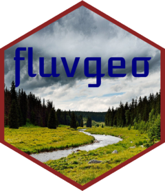

<!-- README.md is generated from README.Rmd. Please edit that file -->
<!-- devtools::build_readme() -->

```{r, include = FALSE}
knitr::opts_chunk$set(
  collapse = TRUE,
  comment = "#>",
  fig.path = "man/figures/README-",
  out.width = "100%"
)
```

# fluvgeoapi <a href="https://fluvialgeomorph.github.io/fluvgeoapi/"></a>

<!-- badges: start -->
[](https://lifecycle.r-lib.org/articles/stages.html#experimental)
[](https://CRAN.R-project.org/package=fluvgeoapi)
[](https://github.com/FluvialGeomorph/fluvgeoapi/actions/workflows/R-CMD-check.yaml)
[](https://app.codecov.io/gh/FluvialGeomorph/fluvgeoapi?branch=main)
<!-- badges: end -->

The goal of fluvgeoapi is to ...

## Installation

You can install the development version of fluvgeoapi from [GitHub](https://github.com/) with:

``` r
# install.packages("devtools")
devtools::install_github("FluvialGeomorph/fluvgeoapi")
```

## Run API Locally
The following command allows you to interactively test the API interface locally. 

``` r
plumber::plumb(file='inst/plumber/fluvgeo-api.R')$run()
```

